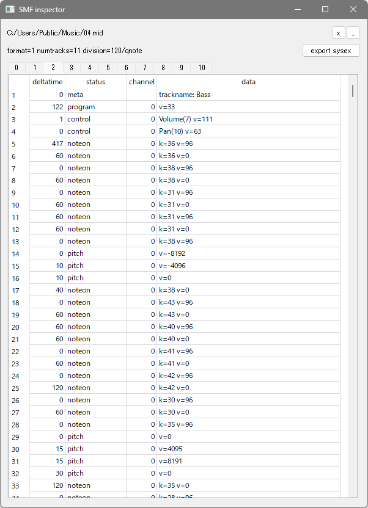

# smfinspect
 

## What is this?

A python script for parsing standard MIDI files (SMF).
This script breaks down SMF files into the header, tracks and events and displays them.

## Requirement

* Python 3.x
* PyQt5

## Written by

[yu2924](https://twitter.com/yu2924)

## License

CC0 1.0 Universal
